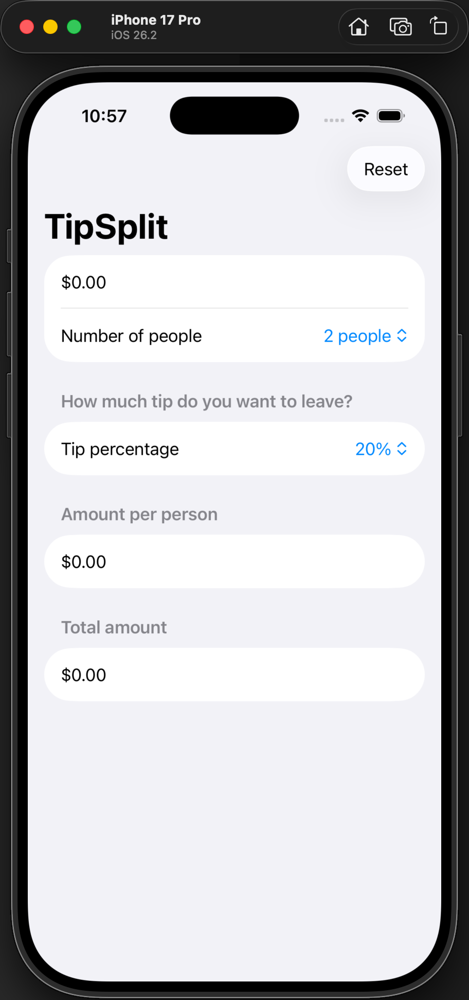

# TipSplit

A SwiftUI tip calculator demonstrating clean state management, pure business logic separation, and XCTest coverage.

## Overview

TipSplit is a bill-splitting app designed to illustrate:

- SwiftUI state management
- Separation of concerns via a pure calculation model (`BillCalculator`)
- Computed properties for derived state
- Currency and percent formatting
- Keyboard focus management
- Unit testing with XCTest

## Architecture

The app separates UI and business logic:

- `ContentView` → UI layer (SwiftUI)
- `BillCalculator` → Pure, testable calculation model
- `BillCalculatorTests` → Unit tests validating core math

This structure keeps business logic independent of the UI and fully testable.

## Features

- Tip selection (0%–100%)
- Bill splitting by number of people
- Conditional styling for 0% tip
- Reset functionality
- Unit test coverage for calculations

## Tech Stack

- SwiftUI
- XCTest
- Git + GitHub

## Screenshots
